These instructions will walk you through submitting Problem Sets and Exams. Gov 50 staff have worked very hard to make this process as smooth and convenient as possible for you, but it can confusing the first few times! This document walks through each step of the process. 

Here is a **checklist** at the bottom of this document that you may find it helpful to consult before submitting assignments. More detailed instructions are found below.

---

## Checklist

You can use this checklist before submitting an assignment to make sure you don't miss anything!

1. Accept the GitHub classroom invite.
2. Use RStudio to "Clone with HTTPS" this repo to your computer.
3. Start an empty R Markdown file for your answers.
4. Make progress.
    * Follow the course [Style Guide](https://davidkane9.github.io/PPBDS/tools.html#style-guide) for your code.
    * As you do, push your files to GitHub at least 5 times. For example, at least once after every question.
    * You can check answers with the autograder at any point!
    * Name your chunks!
    * Set echo=FALSE in your first setup chunk. We do not want to see any of your R code in the main portion of the PDF. The only place R code appears is in the ## Code section at the end
    * Do not print the results of your individual chunks to the .pdf.
    * Make sure you add meaningful comments to your code. Comments are discussed at length in the course [Style Guide](https://davidkane9.github.io/PPBDS/tools.html#style-guide).
    * Include names of colleagues for problem sets (no collaboration on exams).
    * Include a code chunk with these options: *{r print-code, ref.label=knitr::all_labels(), echo = TRUE, eval=FALSE}* You may find it helpful to force this to print on a new page, as described below
    * Make sure to add *Rproj to your .gitignore.
5. Push submittable version to GitHub.
6. Upload .zip to autograder.
7. Upload final .pdf (with code) to Gradescope.
    * Are you sure you removed all warnings, messages, or errors?
    * The only things that should appear in your .pdf are plots, paragraph answers, and a single chunk with all of your code and comments at the end.

---

## 1. Accept the GitHub classroom invite

You will start Problem Sets and Exams by making your own copy of GitHub repositories created by the course staff. To start, you will receive an email invitation to GitHub Classroom. Click on the link and accept the invitation! 

```{r, echo=FALSE, fig.align="center", fig.cap="***This is what the invite will look like! Click accept.***"}
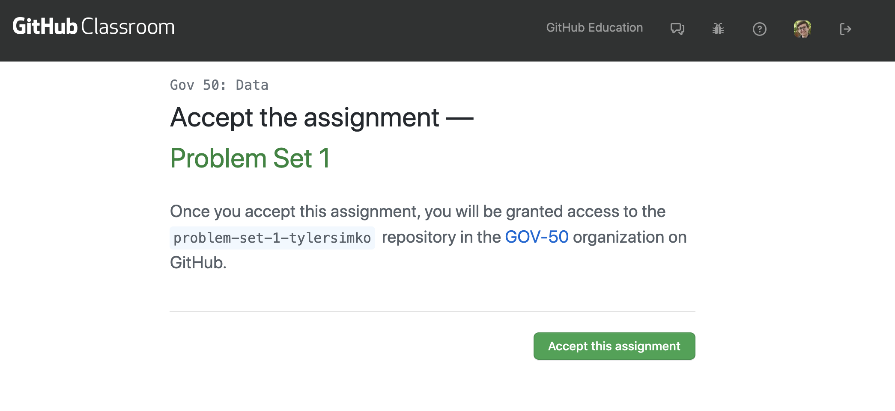
```

Accepting the invitation will create a copy of the repository on your own GitHub account. These repositories will contain Problem Set instructions in an .html file and a README. Your empty repository will look like this:

```{r, echo=FALSE, fig.align="center", fig.cap="***A fresh start!***"}
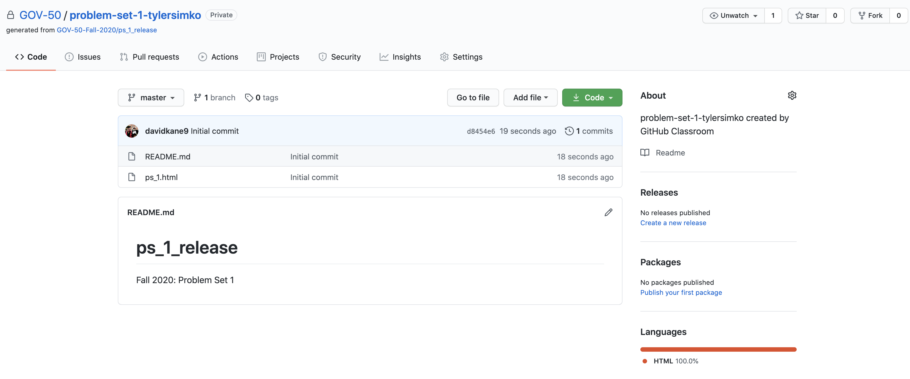
```

---

## 2. Use RStudio to "Clone with HTTPS" this repo to your computer

Now that the repository exists on your GitHub account, you need to "Clone with HTTPS" to clone it to your own computer. This process is what connects files on your computer to your GitHub account. This process will be fully covered in class, but you can review it anytime in the ["Tools" Chapter](https://davidkane9.github.io/PPBDS/tools.html#git-github-rstudio) of The Primer.

```{r, echo=FALSE, fig.align="center", fig.cap="***Remember this? This is why it's useful! See the Tools Chapter for more details.***"}
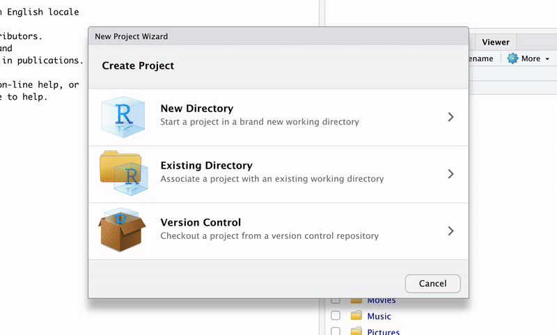
```

---

## 3. Start an empty R Markdown file for your answers

Once your repo is cloned, you should make an empty R Markdown (.Rmd) file to store your solutions. You must follow the course naming convention in order for the autograder to work, which is *ps_1.Rmd* or *exam_1.Rmd* with "1" replaced by the number of the assignment you're working on. Click *File* -> *New File* -> *R Markdown*, enter the Title and Author values, and select PDF as the output.

Recall that the .Rmd file is a technical document for text and code. This is a record of your work which allows us to reproduce your .pdf file. It should be well-organized, nicely formatted and clean. 

The .pdf file is a presentation document, designed for non-technical readers. No R code (except for your entire replication code at the end, described below), messages, warnings, or errors should appear.

Students often have trouble turning off R messages / warnings / errors. These may not appear in your .pdf. Sometimes you notice random things you did not type appearing in your .pdf that look like the sort of messages that often appear in your RStudio Console. These are messages, warnings, and errors. The right way to deal with these issues is to find out their cause and then fix the underlying problem. 

Students sometimes use “hacks” to make these messages/warnings/errors disappear. The most common hacks involve using code chunk otions like message=FALSE, warning=FALSE, results=“hide”, include=FALSE and others. Don’t do this, in general. A message / warning / error is worth understanding and then fixing. Don’t close your eyes (metaphorically) and pretend that the problem doesn’t exist. 

There are some situations, however, in which, no matter what you try, you can’t fix the problem. In those few cases, you can use one of these hacks, but you must make a code comment directly below it, explaining the situation. The only exception is the “setup” chunk (included by default in every new Rmd) which comes with include=FALSE. In that chunk, no explanation is necessary, by convention. Packages will often automatically print out warnings or messages when you load them with library(). Using a chunk option like message=FALSE will get rid of these. 

This is where your solutions will go! These files are pre-populated with some example code. You can delete everything under the *setup* code chunk. 

```{r, echo=FALSE, fig.align="center"}
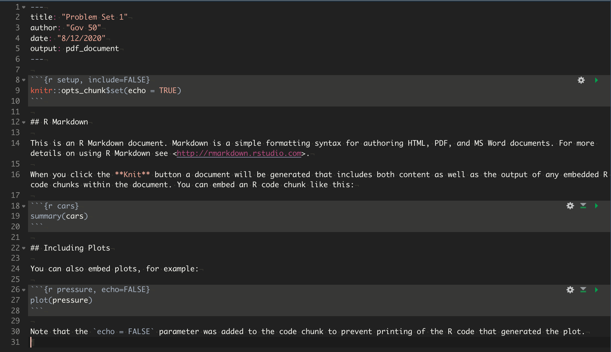
```

Finally, save this .Rmd file **into your cloned repository**. 

---

## 4. Make progress 

Here's where you actually do the assignment! Answer the questions and use GitHub as you go to add, commit, and push changes as you make them. Create a **named** code chunk for each new question (remember that naming a code chunk just means putting a short title after the lowercase *r* in the code chunk, in the example below the names are *q1* and *q2*), and remember to set "echo=FALSE" in the setup chunk so that each chunk is not printed in the final output. 

```{r, echo=FALSE, fig.align="center"}
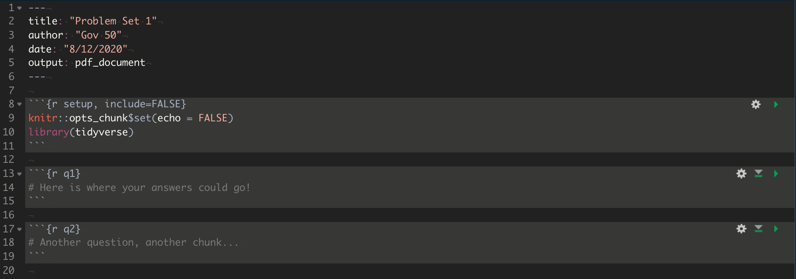
```

---

## 5. Push submittable version to GitHub

Do not wait until your file is ready to submit to try pushing to GitHub. You **need to push files to your GitHub at least five times while working on problem sets and exams**. It is good practice to make gradual commits to your repository as you make progress. 

Eventually, you will be done! Once you're ready to submit something, make sure you push the latest version to your GitHub repo. Do not forget to add your .Rproj to your .gitignore. You should not upload your .Rproj file to GitHub. 

---

## 6. Upload .zip to autograder

We require you to complete **two separate uploads** for each Problem Set and Exam. The "Zip file" assignment requires you to upload a zipped folder of your GitHub repository, and the PDF assignment requires you to upload a PDF of your completed response. This is because you have the ability to automatically check your problem set and exam solutions **as you complete them**. 

When you're ready to submit something to the autograder, download a .zip file of your GitHub repo. This will create a .zip file for you and save it wherever Downloads save on your computer. For example, on my Mac this created a file called *problem-set-1-tylersimko-master.zip* and saved it to my *Downloads* folder.

If you're using the Safari browser, you may have trouble finding your .zip file. This is because some versions of Safari automatically unzip files by default. Follow the short instructions at [this link](https://wiki.umbc.edu/pages/viewpage.action?pageId=31919091) to fix it (thanks to [Matt Blackwell](mattblackwell.org) for this suggestion!).

```{r, echo=FALSE, fig.align="center", fig.cap="***Make sure you push the latest version before downloading!***"}
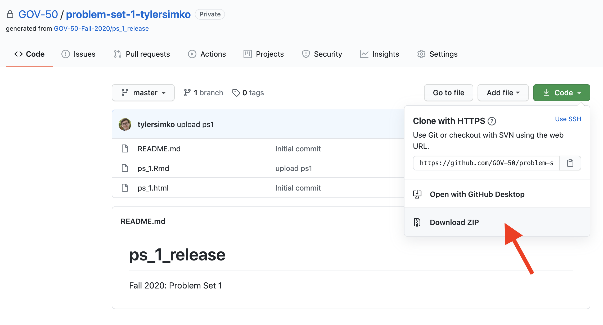
```

Once you have your .zip, follow the Gradescope link for the assignment (or use the Gradescope link on Canvas). You will see a list of your upcoming assignments:

```{r, echo=FALSE, fig.align="center", fig.cap="***Two uploads for each assignment!***"}
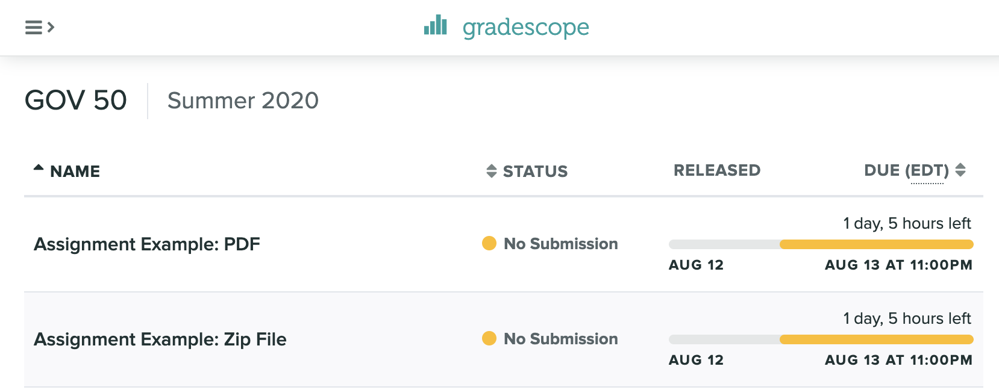
```

Click on the Zip file assignment, and you'll be brought to a submission prompt that looks something like this. Upload the .zip file containing your repo, and Gradescope will automatically unzip it. Press Upload to start the autograder.

```{r, echo=FALSE, fig.align="center"}
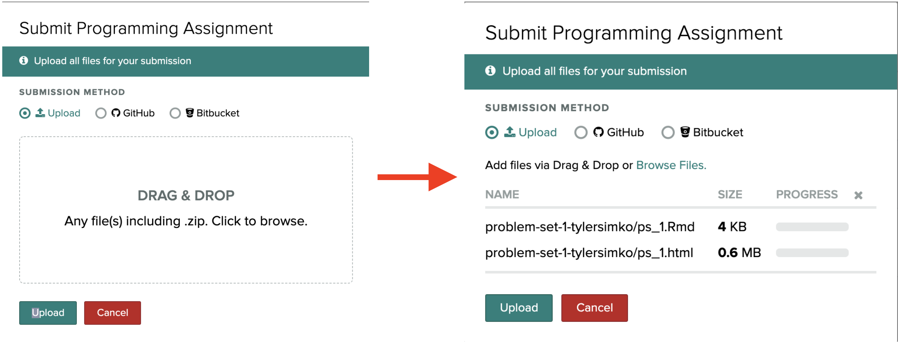
```

This runs a bunch of code (that by the end of this course, you will be more than capable of understanding) that will automatically grade most questions on your assignment. The autograder will take a few seconds to run, and eventually you will see a page like this:

```{r, echo=FALSE, fig.align="center", fig.cap="***Make sure to read the messages even (especially!) if your response is incorrect, the messages are there to help you!***"}
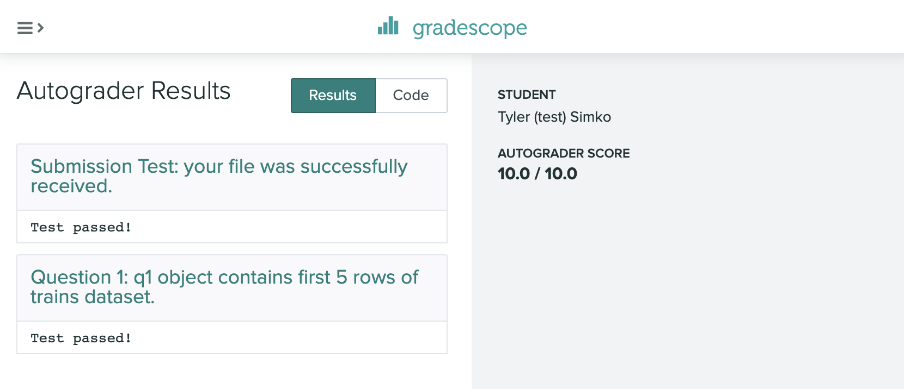
```

The two messages here (called "tests") check (1) if the file structure is correct and (2) whether your answers are correct. Typically, there will be one test per question on the assignment. Here, I succesfully uploaded the file and answered Question 1, so I received full credit. If Question 1 were wrong in some way, you would see a helpful message here telling you what happened and pointing you in the right direction. For example, here Question 1 asks you to slice the first 5 rows in the `trains` dataset. If you had submitting an object that was too large, the error message here would say something like: *your object q1 contains more than 8 rows when it should contain 5, are you sure you sliced the first 5 rows?* Error messages are helpful - read them!

Most importantly, **you can do this process as many times as you want!** That means **you are able to grade your problem sets and exams as you work on them**. Gradescope will store your final submission as your final grade for the assignment, but **you can submit a .zip file to the autograder as many times as you want with no penalty**. Take advantage of this! 

---

## 7. Upload final .pdf (with code) to Gradescope

Finally, you will submit your PDF so that course staff can grade any remaining questions not covered by the autograder - questions like plots, written answers, and code style. At the end of your .Rmd file, you should include an empty code chunk with the following code in brackets: *r print-code, ref.label=knitr::all_labels(), echo = TRUE, eval=FALSE*. This code chunk will print out all of the code in your chunks above. In order for this to work, your chunks will have to be named. You can also include a *\\newpage* command in your text to force your code output to print on a new page. Here is an example shown below. For Problem Sets, you should also include the names of colleagues that you worked with in your final .pdf. We define "worked with" very broadly. It would include, for example, students you discussed strategies with during Study Hall. 

```{r, echo=FALSE, fig.align="center", fig.cap = "***An example of a properly done code style chunk.***"}
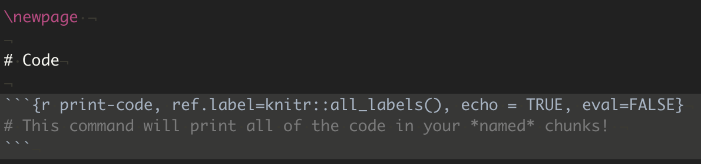
```

Once you have your PDF prepared, go to Gradescope and click on the "PDF" assignment. Then, Gradescope will prompt you to select the pages that each written question is on (this is another reason why *\\newpage* can be helpful!). Follow the instructions and press Submit when you're done! 

```{r, echo=FALSE, fig.align="center", fig.cap="***Almost there!***"}
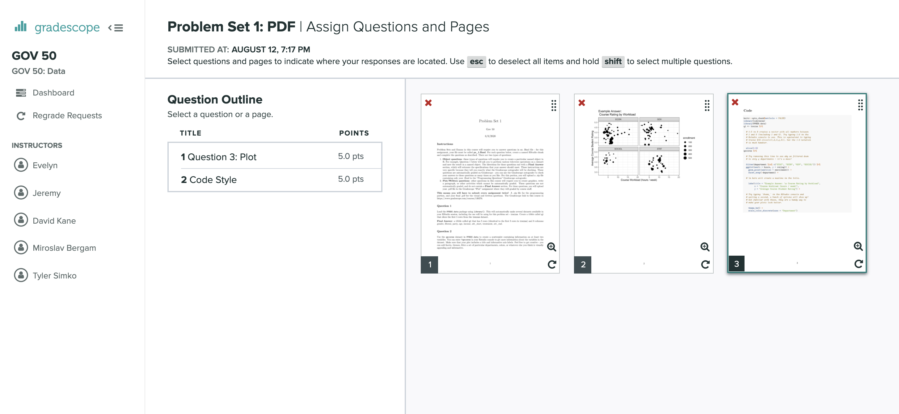
```
